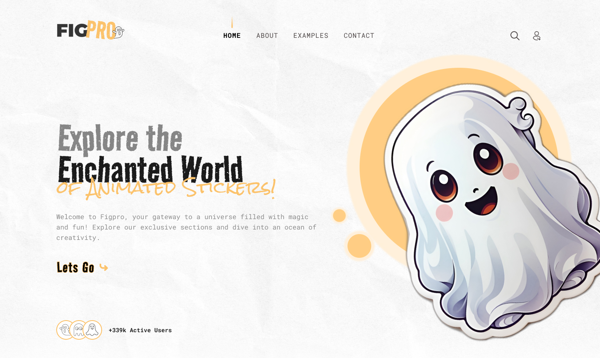

# FigPro



## Pré-requisitos

Antes de começar, certifique-se de ter o seguinte instalado em seu sistema:

- [Node.js](https://nodejs.org) (versão 12 ou superior)
- [Yarn](https://yarnpkg.com/getting-started/install)

## Como Rodar o Projeto

Para rodar este projeto, siga os passos abaixo:

### 1. Instalando as dependências:

Execute o seguinte comando para instalar as dependências necessárias:
```bash
yarn
```
### 2. Inicie o Servidor:

Após a instalação das dependências, execute o seguinte comando para iniciar o servidor:
```bash
gulp
```

O servidor será iniciado e estará disponível em `http://localhost:3000`.

> Nota: Certifique-se de que a porta 3000 está livre em seu sistema.

### 3. Acessando o Servidor em Dispositivos Móveis:

Você também pode acessar o servidor em um navegador móvel, utilizando o endereço IP da sua máquina seguido da porta 3000. Por exemplo:

```bash
http://ip-da-sua-maquina:3000
```

## Créditos

Este projeto foi desenvolvido como parte do curso oferecido pelo [Codeboost](https://codeboost.com.br/). O layout foi criado por [Designer](https://www.instagram.com/brian_ux/).
